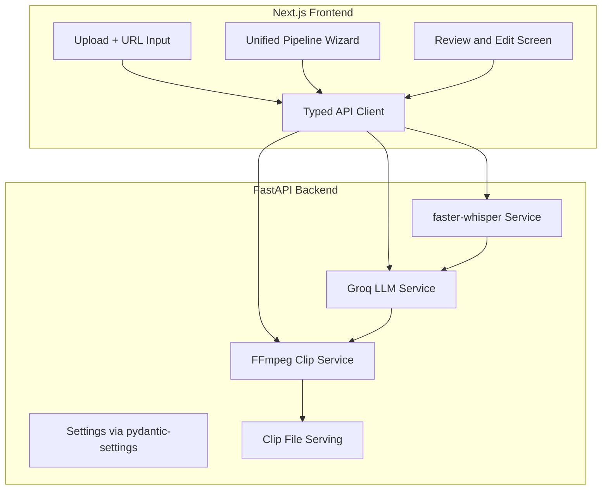
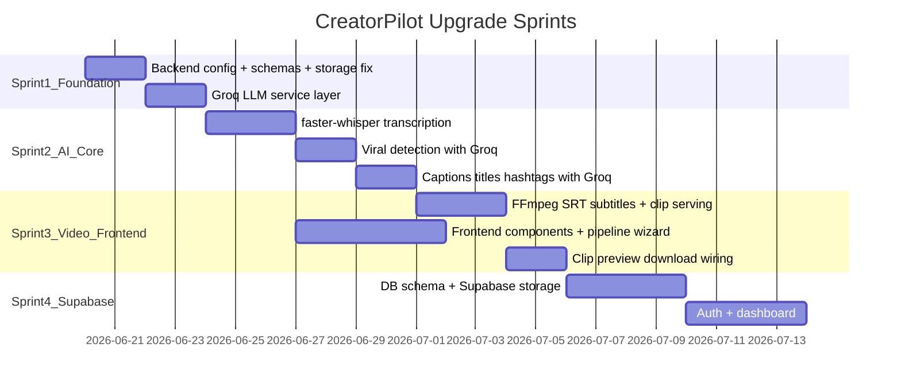

# CreatorPilot AI — Massive Upgrade Plan

## Current State vs Vision

Your [vision document](C:\Users\Anish\Desktop\content\CreatorPilot_AI_Project_Plan%20(1).docx) describes a full **AI Content Operating System**. The codebase today is a thin shell:

| Area | Vision | Current Reality |
|------|--------|-----------------|
| Transcription | faster-whisper + timestamps + language detection | Stub string in [`backend/app/services/transcription.py`](backend/app/services/transcription.py) |
| Viral detection | Groq LLM scoring transcript segments | 3 hardcoded clips in [`backend/app/services/viral_detection.py`](backend/app/services/viral_detection.py) |
| Captions/titles/hashtags | Groq platform-specific prompts | Template stubs in [`backend/app/services/content_generation.py`](backend/app/services/content_generation.py) |
| Clip generation | FFmpeg + timestamp subtitles + face centering | Partial FFmpeg in [`backend/app/services/clip_generation.py`](backend/app/services/clip_generation.py) — **broken on Windows** (`Path("/storage/clips")`) |
| Storage/DB | Supabase Postgres + Storage | Local filesystem only, no persistence |
| Auth | Supabase Auth | None |
| Frontend | Guided workflow, review screen, dashboard | 8 flat pages, `sessionStorage`, hardcoded `localhost:8000`, emoji UI |

**Your priorities:** Core AI pipeline first, with Supabase + Groq available.

---

## Target Architecture (Phase 1 Focus)



---

## Phase 1 — Core AI Pipeline (Primary Focus)

### 1A. Backend Foundation

**Add centralized config and fix storage paths.**

Create new files:
- [`backend/app/core/config.py`](backend/app/core/config.py) — `pydantic-settings` loading `GROQ_API_KEY`, `STORAGE_DIR`, `GROQ_MODEL`, `WHISPER_MODEL_SIZE`
- [`backend/.env.example`](backend/.env.example) — document all required env vars
- [`backend/app/schemas/`](backend/app/schemas/) — shared Pydantic models (`TranscriptSegment`, `ViralClip`, `GeneratedClip`, `CaptionSet`, etc.)

**Fix critical bug** in [`backend/app/services/clip_generation.py`](backend/app/services/clip_generation.py):
```python
# Replace hardcoded Unix path
output_dir = Path("/storage/clips")
# With config-relative path matching upload storage
output_dir = settings.CLIPS_DIR  # e.g. backend/storage/clips
```

**Add static file serving** in [`backend/app/main.py`](backend/app/main.py) so the frontend can preview/download generated clips via `/api/v1/files/{path}`.

Update [`backend/pyproject.toml`](backend/pyproject.toml) dependencies:
- `faster-whisper` — local transcription
- `groq` — LLM API client
- `pydantic-settings` — env config
- `supabase` — prep for Phase 2 (optional in Phase 1)

---

### 1B. Real Transcription Pipeline

Rewrite [`backend/app/services/transcription.py`](backend/app/services/transcription.py):

- Run **faster-whisper** on extracted WAV audio (model: `base` or `small` for speed on CPU)
- Return structured output:
  - `text` — full transcript
  - `language` — detected language code
  - `segments[]` — `{ start, end, text }` per Whisper segment
  - `duration` — video length
- Save transcript as **JSON** (not plain `.txt`) to `backend/storage/transcriptions/{id}.json`
- Update [`backend/app/api/api_v1/endpoints/transcribe.py`](backend/app/api/api_v1/endpoints/transcribe.py) to return the full segment structure

**Frontend impact:** Upload page and new transcript viewer can show timestamped segments instead of a flat string.

---

### 1C. Groq LLM Service Layer

Create [`backend/app/services/llm.py`](backend/app/services/llm.py) — single Groq client wrapper with:
- Retry + timeout handling
- JSON-mode responses for structured parsing
- Prompt templates per task

**Viral clip detection** — rewrite [`backend/app/services/viral_detection.py`](backend/app/services/viral_detection.py):
- Input: transcript segments with timestamps (not just flat text)
- Prompt: score each segment for hook/emotional/educational/storytelling/high-retention
- Output: ranked clips with `start_time`, `end_time`, `segment`, `viral_score`, `clip_type`, `reason`
- Validate timestamps against video duration; merge overlapping segments

**Captions & titles** — rewrite [`backend/app/services/content_generation.py`](backend/app/services/content_generation.py):
- Parallel Groq calls per platform (YouTube, Instagram, TikTok, LinkedIn, X)
- Title styles: viral, SEO, educational, curiosity
- Return 3 caption variants per platform (professional, casual, storytelling)

**Hashtags** — rewrite [`backend/app/services/hashtag_generation.py`](backend/app/services/hashtag_generation.py):
- Groq topic extraction from transcript
- Merge with curated per-platform trending tag lists (static JSON file, refreshable)

Update endpoints in [`backend/app/api/api_v1/endpoints/`](backend/app/api/api_v1/endpoints/) to accept optional `segments` alongside `transcript` for richer context.

---

### 1D. Upgraded FFmpeg Clip Pipeline

Enhance [`backend/app/services/clip_generation.py`](backend/app/services/clip_generation.py):

1. **SRT subtitle generation** from Whisper segments within clip time range (not static `drawtext`)
2. **FFmpeg `subtitles` filter** for proper burned-in captions synced to speech
3. **9:16 reframing** — keep current scale/pad; add optional OpenCV face-detection centering as a follow-up enhancement (not blocking Phase 1)
4. **Per-clip progress** returned in response metadata
5. **Serve clips** via new static endpoint for preview/download

Add new endpoint `GET /api/v1/clips/{clip_id}/download` for direct file download.

---

### 1E. Unified Pipeline API

Add a orchestration endpoint to reduce frontend round-trips:

- `POST /api/v1/pipeline/run` — accepts `video_path`, runs: transcribe → viral-detect → (optional) generate-clips → captions → hashtags
- Returns job-like response with all step results
- For Phase 1: synchronous with step-by-step status in response (async jobs in Phase 2)

Keep existing granular endpoints for manual step-by-step use.

---

### 1F. Frontend Massive Upgrade (Core Pipeline UX)

**New shared infrastructure** under [`frontend/`](frontend/):

```
frontend/
├── lib/
│   ├── api.ts          # Typed fetch client, env-based API_URL
│   └── types.ts        # Mirror backend schemas
├── components/
│   ├── layout/         # AppShell, Navbar, Footer
│   ├── pipeline/       # StepIndicator, PipelineProgress
│   ├── upload/         # DropZone, YouTubeUrlInput (UI ready, wired in Phase 2)
│   ├── transcript/     # TimestampedTranscriptViewer
│   ├── clips/          # ClipCard, ClipGrid, VideoPreview
│   └── ui/             # Button, Card, Badge, Toast, Spinner
```

**Key dependency additions** to [`frontend/package.json`](frontend/package.json):
- `@supabase/supabase-js` + `@supabase/ssr` (prep for Phase 2 auth)
- `lucide-react` — replace emoji icons with proper icons
- `clsx` + `tailwind-merge` — utility classes

**New primary workflow page:** [`frontend/app/pipeline/page.tsx`](frontend/app/pipeline/page.tsx)
- Single guided wizard replacing fragmented `/upload` → `/results/*` hops
- Steps: Upload → Transcribe → Detect Clips → Generate Videos → Generate Copy → Review
- Live progress bar per step with error recovery (retry individual steps)
- Persists state to `sessionStorage` initially (Supabase in Phase 2)

**Upgrade existing pages:**
- [`frontend/app/upload/page.tsx`](frontend/app/upload/page.tsx) — redirect to `/pipeline` or embed shared `DropZone`
- [`frontend/app/results/clips/page.tsx`](frontend/app/results/clips/page.tsx) — wire **Preview** (HTML5 `<video>`) and **Download** buttons to backend file endpoint
- [`frontend/app/results/captions/page.tsx`](frontend/app/results/captions/page.tsx) — tabbed platform view with edit-in-place before copy
- [`frontend/app/layout.tsx`](frontend/app/layout.tsx) — global nav, toast provider, consistent dark theme

**Design upgrade:** Keep dark slate/cyan palette but add:
- Persistent sidebar or top nav with pipeline step indicator
- Skeleton loaders instead of emoji spinners
- Toast confirmations on copy/download
- Responsive clip grid with inline video players

**Env config:** `frontend/.env.local.example` with `NEXT_PUBLIC_API_URL=http://localhost:8000`

---

## Phase 2 — Supabase Persistence + Auth (After Core Pipeline Works)

### 2A. Database Schema (Supabase Postgres)

```sql
-- Core tables
users          (id, email, display_name, created_at)  -- via Supabase Auth
projects       (id, user_id, title, source_type, source_url, status, created_at)
videos         (id, project_id, storage_path, duration, format)
transcripts    (id, video_id, text, language, segments JSONB)
clips          (id, transcript_id, start_time, end_time, viral_score, clip_type, segment)
generated_clips(id, clip_id, storage_path, resolution, status)
content_assets (id, project_id, type, platform, content JSONB)  -- captions, titles, hashtags
jobs           (id, project_id, type, status, progress, error, created_at)
```

### 2B. Backend Supabase Integration

- [`backend/app/services/storage.py`](backend/app/services/storage.py) — upload to Supabase Storage buckets (`raw-videos`, `generated-clips`)
- New CRUD services for projects, transcripts, clips
- Associate all pipeline operations with `project_id`
- Replace `sessionStorage` flow with DB-backed project retrieval

### 2C. Frontend Auth + Dashboard

- Auth pages: `/login`, `/register`, `/reset-password` using Supabase Auth
- [`frontend/app/dashboard/page.tsx`](frontend/app/dashboard/page.tsx) — list past projects, processing status, re-open review
- Protected routes via Next.js middleware
- Move pipeline state from `sessionStorage` to Supabase-backed project records

---

## Phase 3 — Jobs, YouTube Import, Publishing, Admin (Vision Completion)

| Feature | Implementation |
|---------|----------------|
| YouTube URL import | `yt-dlp` service + `POST /api/v1/import/youtube` |
| Async job queue | Upstash Redis + FastAPI background worker or Celery |
| Job status polling | `GET /api/v1/jobs/{id}` + frontend progress polling |
| YouTube publishing | Wire existing stub in [`backend/app/services/publishing.py`](backend/app/services/publishing.py) to YouTube Data API OAuth |
| Publishing UI | Connect [`frontend/app/results/publishing/page.tsx`](frontend/app/results/publishing/page.tsx) |
| Analytics page | New `/results/analytics` with clips generated, videos processed KPIs |
| Admin dashboard | `/admin` internal page — users, uploads, job monitor |
| OpenCV face centering | Enhance clip reframing in FFmpeg pipeline |

---

## Implementation Order (Recommended Sprints)



**Sprint 1–3 = your stated priority (core pipeline + frontend overhaul).**
**Sprint 4+ = vision doc completion (auth, persistence, publishing).**

---

## Key Files to Create or Heavily Modify

**Backend (create):**
- `backend/app/core/config.py`
- `backend/app/services/llm.py`
- `backend/app/schemas/transcript.py`, `clip.py`, `content.py`
- `backend/app/api/api_v1/endpoints/pipeline.py`
- `backend/app/api/api_v1/endpoints/files.py`
- `backend/.env.example`

**Backend (rewrite):**
- `backend/app/services/transcription.py`
- `backend/app/services/viral_detection.py`
- `backend/app/services/content_generation.py`
- `backend/app/services/hashtag_generation.py`
- `backend/app/services/clip_generation.py`

**Frontend (create):**
- `frontend/lib/api.ts`, `frontend/lib/types.ts`
- `frontend/components/**` (layout, pipeline, clips, transcript, ui)
- `frontend/app/pipeline/page.tsx`
- `frontend/.env.local.example`

**Frontend (upgrade):**
- `frontend/app/layout.tsx`
- `frontend/app/results/clips/page.tsx`
- `frontend/app/page.tsx` (CTA → `/pipeline`)

---

## Environment Variables Required

**Backend `.env`:**
```
GROQ_API_KEY=...
GROQ_MODEL=llama-3.3-70b-versatile
WHISPER_MODEL_SIZE=base
STORAGE_DIR=./storage
# Phase 2:
SUPABASE_URL=...
SUPABASE_SERVICE_KEY=...
```

**Frontend `.env.local`:**
```
NEXT_PUBLIC_API_URL=http://localhost:8000
# Phase 2:
NEXT_PUBLIC_SUPABASE_URL=...
NEXT_PUBLIC_SUPABASE_ANON_KEY=...
```

---

## Risks and Mitigations

| Risk | Mitigation |
|------|------------|
| Whisper slow on CPU for long videos | Use `base` model; show progress UI; Phase 3 adds async jobs |
| Groq rate limits on free tier | Batch segment analysis; cache results per project |
| FFmpeg missing on machine | Document requirement; health check endpoint reports FFmpeg/Whisper status |
| Large video uploads | Supabase Storage in Phase 2; Phase 1 keep local with size limit (e.g. 500MB) |
| Platform API review for publishing | Phase 3; start with download-only publish workflow |

---

## Success Criteria for Phase 1 (Your Priority)

1. Upload a real MP4 → get timestamped transcript with detected language
2. Groq identifies ranked viral moments with real scores tied to transcript segments
3. FFmpeg generates playable 9:16 clips with speech-synced subtitles
4. Groq generates platform-specific captions, titles, and hashtags from real transcript
5. Single `/pipeline` wizard runs the full flow with preview and download
6. No stub responses remain in transcription, viral detection, or content generation services
